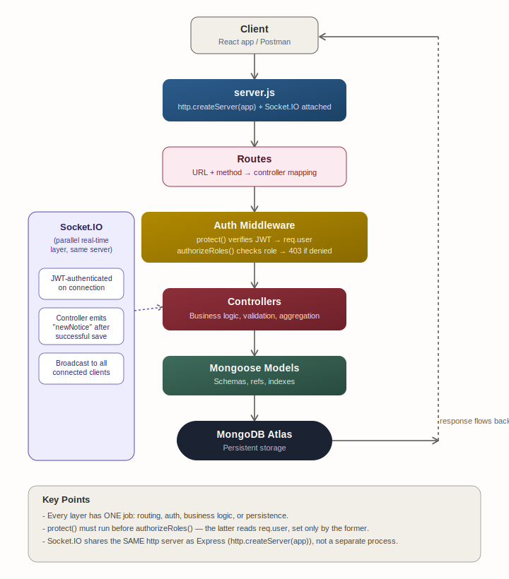
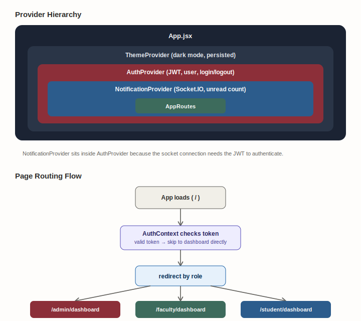
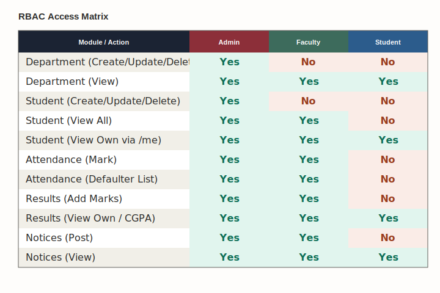
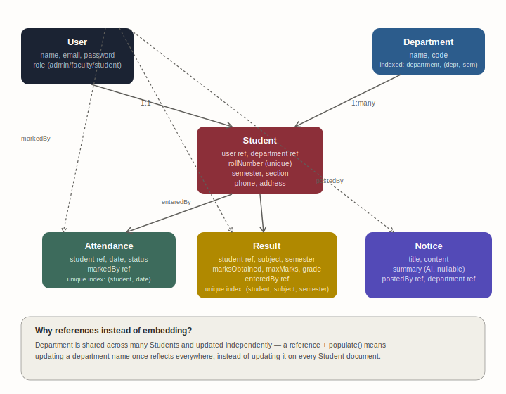

# Architecture Documentation

## AI-Integrated College ERP System

This document describes the complete technical architecture of the project — backend and frontend — as actually implemented. Every module described here is built, tested, and functioning.

---

## 1. Tech Stack

| Layer | Technology |
|---|---|
| Frontend | React.js, Tailwind CSS, React Router, Recharts, lucide-react |
| Backend | Node.js, Express.js |
| Database | MongoDB, Mongoose |
| Authentication | JWT (header-based, single access token), bcrypt |
| Real-time | Socket.IO |
| AI Integration | OpenRouter API |
| Build Tool | Vite |
| Architecture Pattern | MVC (backend), Component + Service layer (frontend) |

---

## 2. Complete Feature List

1. **Auth** — Register, Login, JWT-protected routes
2. **RBAC** — Admin / Faculty / Student roles, route-level permission middleware
3. **Department Management** — Full CRUD, Admin-write / all-read
4. **Student Management** — CRUD, linked to User and Department via Mongoose references, plus an ownership-based `/me` endpoint
5. **Attendance** — Mark attendance, percentage calculation, defaulter list (all via MongoDB aggregation)
6. **Results/Marks** — Marks entry, automatic grade calculation, CGPA calculation (aggregation)
7. **Role-based Dashboards** — Aggregated summary data with charts, per role
8. **Real-time Notifications** — Socket.IO-powered live notice delivery with a global notification bell
9. **AI Notice Summarizer** — OpenRouter API integration with graceful degradation
10. **Centralized Error Handling** — Single Express error-handling middleware
11. **Dark Mode** — Persisted theme preference across sessions

---

## 3. Complete Folder Structure

```
AI-College-ERP/
│
├── backend/
│   ├── src/
│   │   ├── config/
│   │   │   └── db.js                      # MongoDB connection setup
│   │   │
│   │   ├── models/
│   │   │   ├── user.model.js              # Auth users (admin/faculty/student)
│   │   │   ├── department.model.js        # Department schema
│   │   │   ├── student.model.js           # Student profile (ref: User, Department)
│   │   │   │                              # Indexes: department, (department, semester)
│   │   │   ├── attendance.model.js        # Attendance records
│   │   │   │                              # Compound unique index: (student, date)
│   │   │   ├── result.model.js            # Marks/results
│   │   │   │                              # Compound unique index: (student, subject, semester)
│   │   │   └── notice.model.js            # Notices (summary field for AI output)
│   │   │
│   │   ├── controllers/
│   │   │   ├── auth.controller.js         # register, login
│   │   │   ├── department.controller.js   # department CRUD
│   │   │   ├── student.controller.js      # student CRUD + getMyStudentProfile
│   │   │   ├── attendance.controller.js   # mark, percentage, defaulters
│   │   │   ├── result.controller.js       # marks entry, grade calc, CGPA
│   │   │   ├── dashboard.controller.js    # aggregation queries per role
│   │   │   └── notice.controller.js       # CRUD + Socket.IO emit + AI summarization
│   │   │
│   │   ├── routes/
│   │   │   ├── auth.routes.js
│   │   │   ├── department.routes.js
│   │   │   ├── student.routes.js          # /me route defined before /:id
│   │   │   ├── attendance.routes.js       # /defaulters before /:studentId
│   │   │   ├── result.routes.js
│   │   │   ├── dashboard.routes.js
│   │   │   └── notice.routes.js
│   │   │
│   │   ├── middlewares/
│   │   │   ├── auth.middleware.js         # protect + authorizeRoles (RBAC)
│   │   │   └── error.middleware.js        # centralized error handler
│   │   │
│   │   ├── utils/
│   │   │   ├── generateToken.js           # JWT signing
│   │   │   └── summarizeNotice.js         # OpenRouter API call
│   │   │
│   │   ├── socket/
│   │   │   └── socket.js                  # Socket.IO server, JWT auth middleware
│   │   │
│   │   └── seed.js                        # Demo data seeding script
│   │
│   ├── .env
│   ├── server.js                          # Entry point (http.createServer + Socket.IO)
│   └── package.json
│
├── frontend/
│   └── src/
│       ├── pages/
│       │   ├── Login.jsx                  # Split-screen, illustrated
│       │   ├── Register.jsx               # Split-screen, matching Login
│       │   ├── AdminDashboard.jsx         # Charts: bar (departments), pie (grades)
│       │   ├── FacultyDashboard.jsx       # Quick action tiles + snapshot stats
│       │   ├── StudentDashboard.jsx       # Attendance/CGPA/Subjects stat cards
│       │   ├── Students.jsx               # List, create, inline edit, delete
│       │   ├── Departments.jsx            # List, create, delete
│       │   ├── Attendance.jsx             # Role-conditional; donut chart for students
│       │   ├── Results.jsx                # Role-conditional; bar chart for students
│       │   ├── Notices.jsx                # List + AI summary + real-time updates
│       │   └── NotFound.jsx               # 404 catch-all
│       │
│       ├── components/
│       │   ├── Navbar.jsx                 # User info, dark mode toggle, notification bell, role badge
│       │   ├── Sidebar.jsx                # Role-based nav links with icons
│       │   ├── DashboardLayout.jsx        # Combines Sidebar + Navbar + page content
│       │   └── ProtectedRoute.jsx         # Client-side role gate (UX only, not security boundary)
│       │
│       ├── context/
│       │   ├── AuthContext.jsx            # JWT + user info, login()/logout()
│       │   ├── NotificationContext.jsx    # Global Socket.IO connection + unread state
│       │   └── ThemeContext.jsx           # Dark mode state, persisted to localStorage
│       │
│       ├── services/
│       │   ├── api.js                     # Axios instance: JWT interceptor, 401 handler
│       │   ├── authService.js
│       │   ├── studentService.js          # includes getMyProfile (ownership endpoint)
│       │   ├── departmentService.js
│       │   ├── attendanceService.js
│       │   ├── resultService.js
│       │   ├── noticeService.js
│       │   └── dashboardService.js
│       │
│       ├── hooks/
│       │   └── useSocket.js               # Socket.IO connection hook, JWT-authenticated
│       │
│       ├── routes/
│       │   └── AppRoutes.jsx              # All route definitions + ProtectedRoute wrapping
│       │
│       ├── assets/
│       │   └── campus_illustration.svg
│       │
│       ├── App.jsx                        # ThemeProvider > AuthProvider > NotificationProvider > Routes
│       ├── main.jsx
│       └── index.css                      # Tailwind v4 theme tokens, dark mode variant, animations
│
├── postman/
│   └── ERP_System.postman_collection.json
│
├── README.md
├── ARCHITECTURE.md
└── .gitignore
```

---

## 4. Backend Request Flow



Socket.IO runs in parallel as a persistent connection: when `notice.controller.js` successfully creates a notice, it emits a `newNotice` event to all connected clients — received globally via `NotificationContext`, which powers both the Notices page and the Navbar's bell icon simultaneously.

---

## 5. Frontend Architecture



Every dashboard and feature route is wrapped in `ProtectedRoute`, which checks role client-side for UX purposes. The actual security boundary is always the backend's `protect` + `authorizeRoles` middleware.

### 5.1 Data Flow (Page → API → Back)

```
Page component (e.g. Students.jsx)
     │  calls
     ▼
Service function (e.g. studentService.getAllStudents())
     │  uses
     ▼
api.js (shared axios instance)
     │  — request interceptor attaches JWT
     │  — response interceptor handles 401 globally
     ▼
Express API
     │
     ▼
JSON response flows back → setState() updates the page
```

---

## 6. Role-Based Access Control (RBAC) Summary



**Known limitation:** Some routes (e.g. `GET /students/:id`, `GET /results/:studentId`) check role but not ownership — a student with a valid token could technically query another student's ID if they had it. `/students/me` was built specifically to close this gap for the most sensitive case (a student's own profile lookup); extending ownership checks to every student-facing route is a noted future improvement.

---

## 7. Database Schema Relationships



---

## 8. Key Engineering Practices

- **MVC Architecture** — Routes → Controllers → Models, strict separation
- **JWT Authentication** — Stateless, header-based (`Authorization: Bearer <token>`)
- **Password Security** — bcrypt hashing via Mongoose pre-save hook, 10 salt rounds
- **Role-Based Access Control** — Reusable `protect` + `authorizeRoles` middleware chain
- **Ownership-Based Access** — `/students/me` resolves identity from the JWT, not a trusted URL parameter
- **Mongoose Relationships** — `ref` + `populate()` instead of data duplication
- **MongoDB Aggregation Pipelines** — Attendance %, defaulter list, CGPA, and dashboard analytics all computed at the database layer
- **Database Indexing** — Compound unique indexes for data integrity (Attendance, Result); additional indexes on frequently-queried fields (Student.department)
- **Centralized Error Handling** — Single Express error-handling middleware (4-parameter signature)
- **Real-Time Architecture** — Socket.IO sharing the same HTTP server as the REST API, JWT-authenticated handshake
- **Graceful Degradation** — AI summarization failures don't block notice creation
- **Frontend Service Layer** — Pages never call axios directly; all API calls go through per-resource service files
- **Global State via Context** — Auth, notifications, and theme each get a dedicated Context rather than prop drilling
- **CORS Configuration** — Enables the separately-hosted frontend to call the backend safely
- **Environment Variables** — Secrets and config kept out of source code via `.env`
- **RESTful API Conventions** — Proper HTTP verbs and status codes (200/201/400/401/403/404/500)

---

## 9. Common Interview Talking Points This Project Covers

- JWT authentication and stateless session management
- Role-Based Access Control vs. ownership-based authorization (and the gap between them)
- Mongoose schema relationships and `populate()` vs. SQL joins
- MongoDB aggregation pipelines (`$match`, `$group`, `$avg`, `$sum`, `$lookup`)
- Database indexing — compound indexes, uniqueness constraints, query performance
- Password hashing vs. encryption
- REST API design conventions and route-ordering pitfalls (static routes before dynamic `:id` routes)
- MVC architectural pattern
- Real-time communication with Socket.IO — WebSockets vs. HTTP polling, room-based targeting
- Integrating a third-party AI API into a backend service, with failure handling
- Frontend service-layer architecture and centralized HTTP interceptors
- React Context API for global state without prop drilling
- Design system consistency across a multi-page application